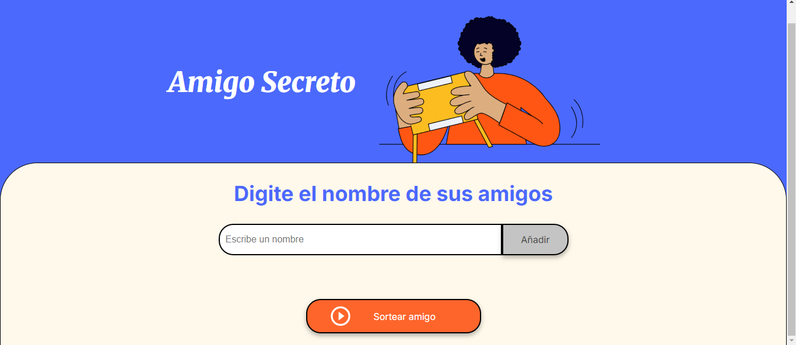
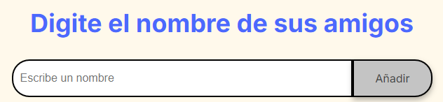
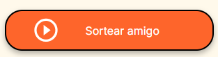
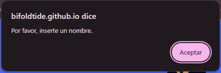
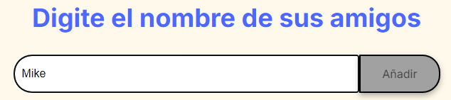
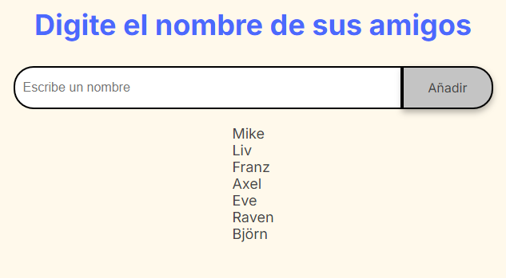
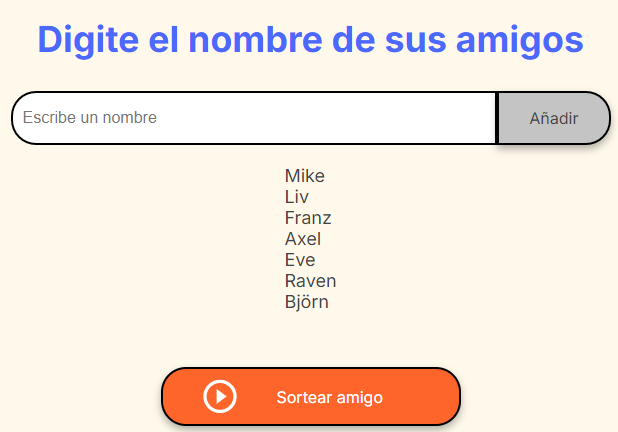
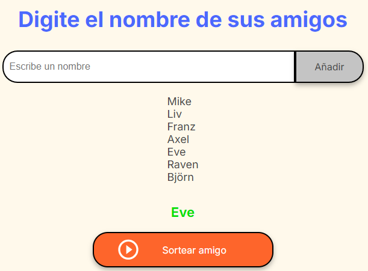

# Desafío Challenge Amigo Secreto
## Por Alura Latam, de Oracle ONE

### Desarrollador:
 
[BifoldTide](https://github.com/BifoldTide)

## Índice:
*[Introducción](#introducción)

*[Funcionamiento](#Funcinoamiento)

*[Licencia y derechos](#Licencia-y-derechos)

## Introducción
Este proyecto es un desafío de parte de Alura Latam para hacer a
sus estudiantes demostrar que entienden y son capaces de poner en
práctica lo aprendido en sus cursos hasta la fecha.
El proyecto corresponde a un "juego", en el cual se asigna una
lista de nombres, y para el que lo pida, se le enrtrega un nombre 
al azar de esta misma lista. Aesta juego de le llama:
"Amigo secreto".

## Funcionamiento
[Link de la página](https://bifoldtide.github.io/challenge-amigo-secreto/)

 
La página tiene dos funciones:

- [Agregar lista de amigos](#agregar-lista-de-amigos)

- [Sortear amigo secreto](#sortear-amigo-secreto)

#### Agregar lista de amigos
La barra para añadir amigos, tiene la capacidad de reconocer cuando no ingresas nada o solo ingresas espacions en blanco. Cuando eso ocurre, la página envía una alerta informando sobre tal acción y no sigue con el listado:

 

Para agregar un nombre a la lista, solo hay que escribir el nombre en el campo de texto, y después, hacer click/tap en el botón "Añadir":

 

Uno puede agregar la cantidad de nombres que quiera, sin problemas, y cada vez que se agregue uno nuevo, el campo para agregar nombres quedará en blanco para ingresar el próximo: 

 

#### Sortear amigo secreto

Después de que tu nombre y el de tus amigos (o los nombres de la gente que participará) estén en la lista, hace falta hacer click/tap en el botón "Sortear Amigo" para obrener un nombre de un amigo al azar:

 

Hecho esto, la aplicación te entregará un nombre al azar, pero conservando la lista tal cual la ingresaste:
 

## Licencia y derechos

La estructura original de la página y la parte visual de ella fueron entregadas por Alura. La parte funcional hecha en JavaScript, el repositorio en Github y el despliegue son de mi creación.

Este proyecto está finalizado, por lo cual no hace falta alguna agregarle más funciones.

Se agradece la atención y comprensión.